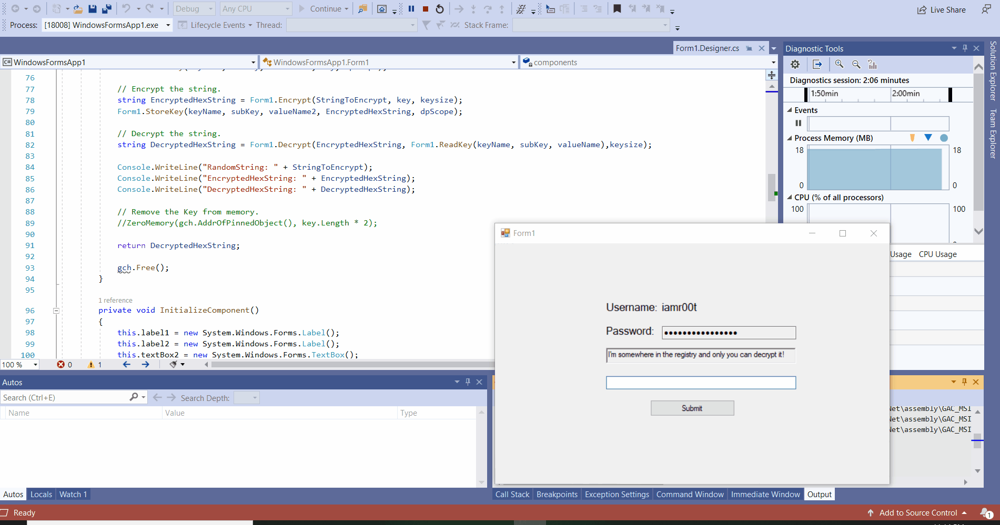

# Terrible-Thick-Client

"Terrible Thick Client" is a vulnerable application developed in C# .NET framework.The vulnerabilities covered so far includes: 
1).Weak cryptography 
2).Lack of code obfuscation 
3).Exposed decryption logic 
4).Sensitive data in memory 
5).Weak implementation of licensing system 

NOTE: The password for this application changes everytime it is executed. :)

### Writeups

https://fabulous-property-93b.notion.site/Terrible-Thick-Client-Pentesting-4f09ef3a935647c3853a739691f2d890

==> References that I used while coding: 
https://docs.microsoft.com/en-us/windows/win32/api/dpapi/nf-dpapi-cryptprotectdata  
https://social.msdn.microsoft.com/Forums/en-US/a23b4ae7-eceb-49f9-bdda-90004567caa4/encrypt-decrypt-data-des-using-dpapi-to-store-key-in-registry?forum=csharplanguage  
